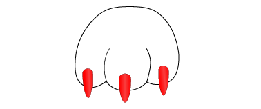
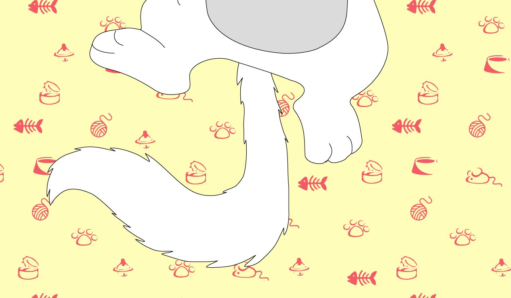

<!DOCTYPE html>
<html>
<head>
	<meta name="viewport" content="width=device-width, initial-scale=1.0">
	<link rel="shortcut icon" href="img/about.jpg" type="image/x-icon" />
	<title>Silphashree</title>
	<link rel="stylesheet" type="text/css" href="sass/style.css">
	
</head>
<body>
<main>
	<section >
		

		
		<a class="sidebar-item item01" href="#about">About</a>
		<a class="sidebar-item item02" href="#work">Works</a>
		<a class="sidebar-item item03" href="#contact">Contacts</a>
		

		

	</section>
	<section class="margin-body">
		

			
		

		

			
			
			
		

		

			

				

					
					<h1 class="txt-heading">About</h1>
					

						Lorem ipsum dolor sit amet, consectetur adipiscing elit. Curabitur ornare justo id fermentum ornare. Duis dictum metus mi, eget rhoncus odio malesuada id. Etiam eros nulla, luctus at enim at, ultrices euismod mauris. Curabitur molestie vitae metus a mattis. Aliquam quis purus non sapien laoreet elementum. Suspendisse dictum diam dui, sed porttitor purus hendrerit eu. Sed ut efficitur risus. Aliquam ultrices egestas lorem, id consequat nunc lacinia at. Integer cursus molestie tempus. Quisque porta metus nulla, sed laoreet velit semper sit amet. Pellentesque vitae ipsum erat. Sed non accumsan nisi. Praesent urna velit, imperdiet non placerat vel, egestas at justo. Quisque diam nunc, commodo in sagittis quis, porta ultrices tellus.
					

					

						Fusce in libero et orci convallis laoreet ut a nulla. Sed diam nunc, imperdiet quis risus in, sodales eleifend turpis. Cras vehicula lorem eu lacus elementum sollicitudin vel eu tellus. Integer consequat, tellus eget fringilla lacinia, ante nisl fermentum ex, vel iaculis nisi nibh id diam. Etiam non erat nec ipsum eleifend interdum vel sed diam. Donec mollis faucibus pulvinar. Maecenas maximus purus vel aliquet feugiat. Praesent porttitor, magna id eleifend varius, velit mi scelerisque magna, molestie molestie mauris enim eget velit. Integer quis blandit urna, eget elementum sem. Duis aliquam eros magna, sed dignissim dui ullamcorper at.
					

					
					
				

				

					
					<h1 class="txt-heading">My works</h1>
					
					

													

						

							<a class="work-list Gayathri float-left" href="">Gayathri Gallerie</a>
						

						

							<a name="esthetician01" id="esth-small" class="work-list nails float-left" data-exp="#nail-exp" href="#esthetician02">Esthetician</a>
						

						

						 <a name="esthetician02" class="float close" data-small="#esth-small" data-close="#nail-exp" href="#esthetician01">X</a>
						 

							<ul class="slides">
							<li class="slide"> </li>
							<li class="slide"> </li>
							<li class="slide"> </li>
							<li class="slide"> </li>
							<li class="slide"> </li>
							<li class="slide"> </li>
							</ul>
						 

						

						

							<a name="gen1" id="gen-small" class="work-list animation float-left" data-exp="#general" href="#gen">General Showreel</a>
						

						

						<a name="gen" class="float close" data-small="#gen-small" data-close="#general" href="#gen1">X</a>
						  <iframe class="my-img" width="560" height="315" src="https://www.youtube.com/embed/1ajXImXzAEk" frameborder="0" allowfullscreen></iframe>
						  
General Showreel

						

						

							<a name="film02" id="film-small" class="work-list animation float-left" data-exp="#film" href="#film01">Stop Motion Film</a>
						

						

						<a name="film01" class="float close" data-small="#film-small" data-close="#film" href="#film02">X</a>
						  <iframe class="my-img" width="560" height="315" src="https://www.youtube.com/embed/sZUT67oAAUY?list=FL8HgZVGQWBidKQqMqItthsg" frameborder="0" allowfullscreen></iframe>
						  
Short Film

						
	

						
						

							<a name="rig02" id="rig-small" class="work-list animation float-left" data-exp="#rig" href="#rig01">Rigging Showreel</a>
						

						

						<a name="rig01" class="float close" data-small="#rig-small" data-close="#rig" href="#rig02">X</a>
						  <iframe class="my-img" width="560" height="315" src="https://www.youtube.com/embed/SHnPOtNhOzY" frameborder="0" allowfullscreen></iframe>
						  
Rigging Showreel

						
	

					
	
				

				

						
					

						
email: roshh1@gmail.com

						
Toronto/Cananda

						
						
						
					
		
					

						<form id="contact_form" class="" action="#" method="POST" enctype="multipart/form-data">
						<h3 class="txt-heading">Send a massage</h3>
						

								<label class="txt-para" for="name">Your name:</label> 
								<input id="name" class="input" name="name" type="text" value="" size="30" /> 
						

						

								<label class="txt-para" for="email">Your contact number:</label> 
								<input id="email" class="input" name="email" type="text" value="" size="30" /> 
						

						

								<label class="txt-para" for="email">Your email:</label> 
								<input id="email" class="input" name="email" type="text" value="" size="30" /> 
						

						

								<label class="txt-para" for="message">Your message:</label> 
								<textarea id="message" class="input" name="message" rows="7" cols="30"></textarea> 
						

						<input id="submit_button" type="submit" value="Send email" />
						</form>
					

				

			

		

			

				
			

			

				
			

	</section>
</main>

</body>
</html>
